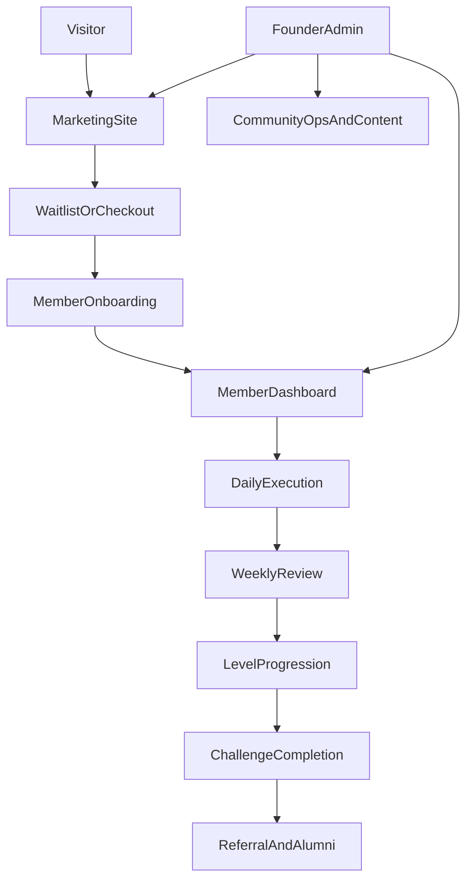

# 6-Month Challenge PRD

## Document Control
- Product: `6-Month Challenge`
- Document type: Product Requirements Document
- Version: `v1`
- Status: Draft for implementation
- Date: `2026-03-10`
- Primary owner: Founder
- Primary audiences: Founder/operator, design, engineering, growth, community ops

## 1. Executive Summary
The `6-Month Challenge` is a discipline and accountability product that combines a public proof-driven brand, a structured transformation program, and a member operating system for daily execution over 180 days.

The current product already establishes the core promise:
- A six-month self-improvement challenge
- A level-based structure
- A daily blueprint
- Weekly missions and scorecards
- Public accountability through the founder's live journey
- A paid offer with community and progress tracking

This PRD turns that promise into a full product system that can support acquisition, onboarding, execution, accountability, monetization, and founder-led operations at a high standard.

## 2. Product Vision
Build the most credible discipline platform on the internet: one that does not sell motivation, but helps ambitious people execute a hard 180-day transformation with structure, accountability, visible proof, and operational simplicity for the founder.

## 3. Problem Statement
Ambitious people often fail not because they lack goals, but because they lack:
- A clear operating system for daily action
- A hard-edged accountability loop
- A simple way to track proof, not just intention
- A community that reinforces standards instead of excuses
- A program that compounds over months instead of delivering short bursts of hype

Most habit apps are too generic, most courses are passive, and most communities are too loose. The opportunity is to create a system that feels like a challenge, a scoreboard, a transformation diary, and an execution engine in one product.

## 4. Product Goals
### Business Goals
- Convert high-intent visitors into paid members or qualified waitlist leads
- Build founder credibility through public proof
- Retain members through weekly and monthly progression
- Increase completion rate and member referrals
- Create a repeatable cohort-based or rolling enrollment business

### User Goals
- Start with clarity instead of confusion
- Know exactly what to do each day and week
- See visible progress and consequence when slipping
- Stay accountable through founder, system, and peer pressure
- Finish 180 days with documented proof of change

## 5. Non-Goals
- A generic habit tracker for every use case
- A broad consumer social network
- Full custom coaching for every member at MVP
- Enterprise wellness or B2B teams at launch
- Heavy AI dependency for core product value

## 6. Primary Users
### 6.1 Founder/Operator
The founder needs a lean system to publish challenge content, manage members, review progress, communicate with cohorts, and grow trust through visible proof without getting buried in admin work.

### 6.2 Challenge Member
The member is ambitious, wants structure, is willing to commit for six months, and values accountability, visible progress, and a high-standard environment more than entertainment.

### 6.3 Secondary Users
- Waitlist lead not yet ready to buy
- Alumni who finished the challenge and can refer others
- Moderator or support operator added later

## 7. Jobs To Be Done
### Member JTBD
- When I commit to transformation, I want a clear daily and weekly system so I do not have to decide from scratch every day.
- When my motivation drops, I want a structure and accountability layer that keeps me moving anyway.
- When I make progress, I want that progress made visible so I build identity and momentum.
- When I slip, I want the system to surface it quickly and push me back into action.

### Founder JTBD
- When I launch or run a cohort, I want to manage content, members, and communication from one system.
- When members stop engaging, I want to know quickly and trigger reminders or interventions.
- When people evaluate the brand, I want public proof and member outcomes to make the product credible.

## 8. Product Principles
- Proof over inspiration
- Structure over flexibility by default
- Progress must be visible
- Friction should support commitment, not block it
- Founder credibility is a core product asset
- Manual operations are acceptable at MVP only if they do not break scalability

## 9. Current Product Inputs
The current codebase provides the starting point for the PRD:
- `app/page.tsx` defines the public landing flow
- `app/journey/page.tsx` defines the founder public progress page
- `lib/phaseData.ts` defines the challenge curriculum and action themes
- `lib/journeyData.ts` defines the progress/check-in model and founder data shape
- `components/landing/WhatYouGet.tsx` defines feature promises
- `components/landing/HowItWorks.tsx` defines the core user flow
- `components/landing/Pricing.tsx` defines monetization intent
- `components/landing/Blueprint.tsx` defines the daily operating system
- `components/landing/FounderJourney.tsx` defines the proof engine and founder-led trust loop

## 10. Program Structure Requirement
The current experience mixes `5 phases` and `6 levels`. The product must normalize this before expansion.

Requirement:
- The product canonical structure will use `6 levels over 180 days`
- Existing five levels map to the current challenge themes already defined in the app
- Level 6 becomes the final integration and completion stage, currently hinted at in `lib/journeyData.ts` as `Unstoppable`
- All landing, member, journey, admin, analytics, and content models must use the same terminology

Proposed level model:
1. Command Time
2. Forge Discipline
3. Raise Standards
4. Build a Fortress Mind
5. Execute Without Mercy
6. Become Unstoppable

## 11. Product Scope
The product includes three connected surfaces:
- Public marketing site
- Member application
- Founder/admin operating system

## 12. End-to-End Experience
### 12.1 Acquisition
Visitor discovers the challenge through X, founder proof, direct referral, content, or organic search. They land on the site, understand the promise fast, see proof that the founder is doing it live, and either join a waitlist or purchase access.

### 12.2 Onboarding
After signup or purchase, the member creates an account, selects a primary mission, sets a start date, accepts the rules, establishes a baseline, and gets a day-1 activation checklist.

### 12.3 Daily Use
The member lands in a dashboard showing current level, today's checklist, streak, proof requirements, reminders, and what is due next. They complete tasks, log proof, and close the day with a review.

### 12.4 Weekly and Monthly Progression
The system requires weekly scorecards and monthly reviews, unlocks the next level when completion criteria are met, and surfaces slippage clearly when standards are missed.

### 12.5 Retention and Completion
The member stays active through a combination of visible streaks, cohort accountability, founder updates, reminders, and milestone recognition. The program ends with a final proof package and referral prompt.

## 13. Functional Requirements
### 13.1 Public Marketing Site
The public site must:
- Explain the challenge clearly above the fold
- Communicate who the challenge is for and not for
- Show the level-based structure and daily blueprint
- Showcase founder public proof and live updates
- Present pricing or waitlist flow with clear CTA states
- Capture leads even when visitors are not ready to pay
- Support mobile-first browsing
- Be optimized for SEO, social sharing, and analytics

The public site should:
- Publish testimonials, transformation stories, and proof screenshots
- Support cohort countdowns or enrollment windows
- Include FAQ, objections handling, and trust-building content
- Support referral attribution from X, email, or partner links

Specific page/module requirements:
- Homepage: hero, qualification filter, how it works, level overview, what members get, founder proof, pricing, CTA
- Founder journey page: live progress, check-ins, proof items, link-outs to X, history archive
- Waitlist or checkout page: high-intent conversion flow with minimal friction
- SEO pages: challenge philosophy, rules, founder story, transformation case studies

### 13.2 Waitlist and Checkout
The acquisition funnel must support two states:
- Pre-launch or limited cohort state with waitlist capture
- Open enrollment state with checkout and immediate onboarding

Requirements:
- Capture email, source, and referral metadata
- Trigger confirmation email immediately
- Send founder welcome sequence or launch updates
- Route paid members directly into onboarding
- Track conversion events from landing visit to paid activation

### 13.3 Member Authentication and Access
The member app must:
- Support email/password or magic-link authentication
- Link payment state to account entitlements
- Handle active, paused, refunded, alumni, and banned account states
- Protect member-only content and community data

### 13.4 Member Onboarding
The onboarding experience must include:
- Account setup
- Primary goal selection
- Optional secondary goals
- Baseline self-assessment
- Start date confirmation
- Rules acceptance
- Cohort assignment or rolling start assignment
- First-week setup checklist

Onboarding outputs:
- Member profile created
- Current level initialized
- Baseline metrics stored
- Reminder preferences stored
- First daily checklist generated

### 13.5 Member Dashboard
The dashboard is the product home and must show:
- Current day of 180
- Current level and unlock status
- Today's required actions
- Weekly mission progress
- Streak status
- Last check-in status
- Community or founder update highlights
- Upcoming review deadline

The dashboard should also show:
- Progress bar to day 180
- Missed actions requiring recovery
- Milestone badges
- Quick links to proof upload, check-in, and community

### 13.6 Daily Execution System
The daily execution system must support:
- A daily checklist tied to current level
- A standard blueprint template with room for member-specific scheduling
- Task completion states
- End-of-day review
- Proof capture for required actions
- Missed-day visibility and recovery messaging

Requirements:
- Members can mark tasks complete
- Members can attach proof as text, metrics, image, or link
- The system records timestamped completion data
- The system distinguishes planned tasks, completed tasks, skipped tasks, and incomplete days
- Members can edit same-day entries, but prior-day edits should be controlled

### 13.7 Weekly Missions and Reviews
The product must provide:
- One weekly mission per member per week
- Mission instructions and success criteria
- Weekly scorecard submission
- Wins, misses, lessons, and next-week adjustments
- Required submission deadline

The system should:
- Flag missed weekly reviews
- Unlock the next stage when criteria are met
- Surface trends to the member and founder

### 13.8 Monthly Reviews and Level Progression
The monthly progression system must support:
- Monthly reflection and scorecard
- Level completion criteria
- Level unlocks
- Program completion criteria at day 180
- Exception states for members who miss requirements

Rules:
- A member cannot skip ahead manually
- Unlock logic must be auditable
- Founder/admin can override level state if needed
- Completion should produce a final transformation summary

### 13.9 Proof Logging
Proof is core to credibility and must support:
- Quantitative proof, such as streaks, wake time consistency, workout count, focus sessions, submissions completed
- Qualitative proof, such as lessons, screenshots, notes, journal entries, links to public posts
- Private proof visible only to member and admin
- Optional public proof visible on member profile or community feed

### 13.10 Accountability System
The accountability layer must include:
- Founder public journey
- In-app reminders for missing check-ins
- Streak visibility
- Weekly completion pressure
- Cohort or peer visibility into consistency where appropriate

The accountability layer should include:
- Accountability partner matching
- Public member logs for opt-in members
- Recovery workflows after missed days
- At-risk member alerts for founder/admin

### 13.11 Community
The community experience must support:
- Cohort feed or challenge-wide feed
- Posts for wins, misses, lessons, and proof
- Comments and reactions
- Founder announcements
- Weekly prompts
- Moderation and reporting

The community should:
- Highlight serious, standards-aligned culture rather than casual chatter
- Reward consistency and constructive participation
- Keep noise low through prompts and structured post formats

### 13.12 Founder Insights
Founder-led insight is a differentiator and must support:
- Founder journal entries
- Broadcast updates to members
- Public journey cross-posts
- Commentary on what is working, what is failing, and what members should adjust

### 13.13 Member Profile
Each member should have:
- Display name and handle
- Start date and current day
- Current level
- Primary mission
- Streak data
- Proof summary
- Completion record
- Public profile toggle

### 13.14 Notifications and Reminders
The product must support notifications for:
- Welcome and onboarding completion
- Daily reminder to check in
- Missed-day follow-up
- Weekly review due
- Level unlocked
- Founder broadcast
- Payment and account status updates

Channel strategy:
- MVP: email
- Later: push and SMS for opt-in members

### 13.15 Founder/Admin System
The admin system must support:
- Member list and status management
- Cohort creation and scheduling
- Challenge content management
- Weekly mission scheduling
- Founder journey publishing
- Community moderation
- Broadcast messaging
- Manual overrides for progress or access
- Reporting exports

The admin system should support:
- Segments for at-risk or inactive members
- Simple CRM views for leads and buyers
- Refund and entitlement audit history
- Template-based messaging

## 14. Content Model Requirements
The content system should evolve the current static data model into configurable entities:
- Program
- Level
- Week
- Daily blueprint template
- Mission
- Rule
- Check-in
- Weekly review
- Monthly review
- Proof item
- Milestone
- Announcement
- Community post
- Cohort
- Member profile

Each entity should have:
- Stable IDs
- Status fields
- Visibility fields
- Ordering fields
- Created and updated timestamps

## 15. Suggested Data Objects
### Core Objects
- `User`
- `MemberProfile`
- `Program`
- `Level`
- `Mission`
- `DailyTask`
- `DailyCheckIn`
- `WeeklyReview`
- `MonthlyReview`
- `ProofItem`
- `Milestone`
- `CommunityPost`
- `Announcement`
- `Cohort`
- `Payment`
- `Notification`
- `Referral`

### Notes
- `DailyCheckIn`, `WeeklyReview`, and `MonthlyReview` should inherit the current structure already implied in `lib/journeyData.ts`
- `ProofItem` should preserve support for both `metric` and `note`, then expand to file upload and public link types
- The founder profile should become a first-class `MemberProfile` with elevated publishing permissions

## 16. Tooling and Technical Recommendations
### Core Stack
- Frontend/app: `Next.js` with App Router, continuing from the current codebase
- Hosting: `Vercel`
- Auth, relational database, storage, and row-level security: `Supabase`
- Payments: `Stripe`
- Transactional email: `Resend`
- Analytics and product event tracking: `PostHog`
- Error monitoring: `Sentry`
- Automation and workflow orchestration: `n8n`

### Community Approach
- MVP option A: lightweight in-app structured feed
- MVP option B: external community in `Circle` or `Discord` while product tracking remains in-app
- Recommendation: keep accountability and progress in-app even if community starts externally

### Admin/CMS Approach
- Build a lightweight internal admin dashboard inside the same Next.js app
- Store challenge curriculum in database tables instead of static files
- Preserve export/import compatibility with the current `phaseData` and `journeyData` formats for migration

### Notification Stack
- MVP: email via `Resend`
- Phase 2: mobile/web push
- Phase 3: opt-in SMS for high-intent accountability reminders

### Media and Proof Storage
- Use `Supabase Storage` for proof assets and profile images
- Enforce size and type limits
- Store moderation state on uploaded assets

### Support Stack
- MVP: shared support inbox and FAQ
- Later: `Help Scout` or equivalent for ticketing and macros

## 17. Event Tracking Requirements
The product must track:
- Landing page visit
- CTA click
- Waitlist submit
- Checkout started
- Purchase completed
- Onboarding completed
- Daily check-in submitted
- Weekly review submitted
- Monthly review submitted
- Level unlocked
- Day missed
- Referral generated
- Referral converted
- Founder update opened
- Community post created

All events should support:
- User ID when known
- Anonymous ID when not known
- Cohort ID
- Current level
- Acquisition source
- Device type

## 18. Success Metrics
### Growth Metrics
- Visitor to email capture conversion
- Visitor to purchase conversion
- Waitlist to purchase conversion
- Cost per lead and cost per purchase if paid growth is used

### Activation Metrics
- Purchase to onboarding completion rate
- Onboarding to first check-in completion rate
- Percentage of users completing first 7 days

### Engagement Metrics
- Daily active members
- Weekly active members
- Daily check-in completion rate
- Weekly review completion rate
- Streak length distribution

### Retention Metrics
- Week 4 retention
- Day 30, 60, 90, and 180 retention
- Level completion rate
- Challenge completion rate

### Quality Metrics
- Proof submission rate
- Founder content consumption rate
- Community participation rate
- Member NPS or satisfaction score
- Referral rate

## 19. Operating Model
### Founder Workflow
- Publish challenge content
- Review engagement dashboard
- Broadcast updates to members
- Review at-risk members
- Post public proof and journey updates
- Moderate community

### Weekly Ops Cadence
- Monday: publish weekly mission and founder note
- Midweek: send accountability nudges
- Friday or Sunday: collect and review weekly scorecards
- Monthly: publish level transition guidance and highlight wins

## 20. Risks
- The product becomes too broad and loses the hard-edged simplicity that makes it compelling
- Too much manual founder involvement makes operations unsustainable
- Community quality drops if moderation and structure are weak
- Members churn if the daily system feels punishing without recovery loops
- Tooling complexity slows launch
- The promise of six levels remains inconsistent across product surfaces

## 21. Assumptions
- The brand is founder-led and proof-led, not anonymous
- Early users value structure more than customization
- Email is sufficient for MVP notifications
- A lightweight admin system is enough before a true CMS is needed
- Progress tracking and accountability create more retention than content volume alone

## 22. MVP Definition
The MVP should launch a credible end-to-end paid system, not a prototype.

MVP includes:
- Public site with clear positioning, founder proof, pricing/waitlist, and conversion tracking
- Authentication and paid member access
- Structured onboarding
- Member dashboard
- Daily checklist and check-ins
- Weekly missions and scorecards
- Monthly review flow
- Level progression logic
- Founder public journey and member broadcast updates
- Basic cohort feed or structured announcements
- Email reminders
- Founder/admin dashboard for content and member management
- Analytics and error monitoring

MVP explicitly excludes:
- Native mobile apps
- Advanced AI coaching
- Full custom program builder
- Enterprise/team accounts
- Deep gamification beyond levels, streaks, and milestones

## 23. Post-MVP Roadmap
### Phase 2
- Public member profiles and opt-in proof pages
- Accountability partner matching
- Rich proof uploads and galleries
- Referral program
- Push notifications
- Leaderboards or standards-based rankings if culturally aligned

### Phase 3
- Mobile app
- AI-generated review summaries and risk flags
- Personalized intervention sequences
- Alumni layer and repeat programs
- Coach or moderator roles

### Phase 4
- Multi-program support
- B2B or team challenge mode
- More advanced segmentation and lifecycle automation

## 24. UX and Brand Requirements
The product should feel:
- Serious
- High-standard
- Minimal but intense
- Focused on action, not inspiration wallpaper

Design requirements:
- Strong visual hierarchy
- Obvious current-day and current-level states
- Fast completion flows
- Clear distinction between completed, missed, and due states
- Mobile usability on every critical flow

## 25. Accessibility and Quality Requirements
The product must:
- Meet basic WCAG accessibility expectations for color contrast, keyboard support, and semantic structure
- Load quickly on mobile networks
- Gracefully handle partial completion and network failures
- Protect private member data and proof assets
- Support auditability for payments and level progression changes

## 26. Launch Readiness Checklist
- Challenge taxonomy normalized across all surfaces
- Waitlist and checkout flow finalized
- Authentication and entitlements tested
- Onboarding and daily check-ins fully functional
- Weekly and monthly review flows working
- Founder publishing workflow ready
- Email automations active
- Analytics events verified
- Error monitoring enabled
- Support inbox and FAQ ready

## 27. Recommended Build Order
1. Normalize challenge model from current static files into canonical program entities
2. Replace `mailto` waitlist/payment placeholder with real funnel
3. Build auth, entitlements, and onboarding
4. Build dashboard, daily check-ins, and weekly reviews
5. Build founder/admin publishing and member management
6. Add community and reminder automations
7. Add analytics, reporting, and conversion optimization

## 28. Immediate Product Decisions
These should be resolved before implementation starts in earnest:
- Is enrollment cohort-based, rolling, or both?
- Is the first release waitlist-first or checkout-first?
- Is community native in-app at MVP or external while tracking stays in-app?
- Is proof public by default, private by default, or opt-in?
- What exact completion criteria unlock each level?

## 29. Definition of Success
The product is successful when:
- Visitors quickly understand the promise and trust the founder
- Members know what to do every day without friction
- Progress is visible enough to create momentum
- Accountability keeps members engaged when motivation fades
- The founder can run the system without drowning in manual operations
- The challenge consistently produces proof, testimonials, and repeatable member outcomes
