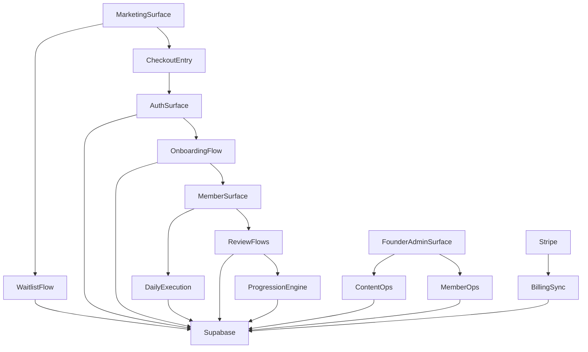

# 6-Month Challenge App Architecture

## Purpose
Define the route groups, service boundaries, and data flow needed to evolve the current marketing-only Next.js app into the full MVP application.

## Current Application State
- `app/page.tsx` is the public landing page.
- `app/journey/page.tsx` is the founder progress page.
- `lib/phaseData.ts` holds the five-phase static curriculum.
- `lib/journeyData.ts` holds founder-only mock progress data.

This means the current app already has the right public storytelling surfaces, but none of the member, auth, admin, or backend-backed operating system layers exist yet.

## Target Surface Model

## Route Group Plan

### `app/(marketing)`
Purpose:
- Public acquisition and credibility surface

Suggested routes:
- `/`
- `/journey`
- `/waitlist`
- `/checkout`
- `/faq`
- `/rules`
- `/founder-story`

Notes:
- `app/page.tsx` and `app/journey/page.tsx` should migrate into this group without changing their public URLs.
- The CTA state should be driven by enrollment-window configuration, not hardcoded marketing copy.

### `app/(auth)`
Purpose:
- Identity and recovery flows

Suggested routes:
- `/login`
- `/signup`
- `/verify`
- `/forgot-password`
- `/reset-password`

Notes:
- Keep all auth routes unauthenticated.
- Redirect paid but uninitialized users to onboarding.

### `app/(member)`
Purpose:
- Member product and execution system

Suggested routes:
- `/onboarding`
- `/app`
- `/app/today`
- `/app/proof`
- `/app/reviews/weekly`
- `/app/reviews/monthly`
- `/app/progress`
- `/app/settings`

Notes:
- `/app` is the dashboard shell.
- `/app/today` is the highest-frequency route and should optimize for fast task completion.
- Proof logging can begin inline in task and review flows, then expand into `/app/proof` for history.

### `app/(admin)`
Purpose:
- Founder/admin operational system

Suggested routes:
- `/admin`
- `/admin/members`
- `/admin/cohorts`
- `/admin/content`
- `/admin/announcements`
- `/admin/founder-updates`
- `/admin/operations`

Notes:
- Gate this route group by `profiles.role = founder_admin`.
- Keep admin workflows inside the same app to avoid a second product surface.

## Layout Strategy
- Root layout handles theme, global styles, metadata, and analytics bootstrapping.
- Marketing layout focuses on public nav, footer, and CTA consistency.
- Auth layout minimizes distraction and keeps recovery flows light.
- Member layout owns protected navigation, session validation, and dashboard chrome.
- Admin layout adds filters, data-table controls, and admin status indicators.

## Service Boundary Plan

### `lib/supabase`
Responsibility:
- Browser and server client initialization
- Session helpers
- Typed query helpers

Expected modules:
- `client.ts`
- `server.ts`
- `middleware.ts`
- `queries/`

### `lib/domain`
Responsibility:
- Domain types and core business logic

Expected modules:
- `programs.ts`
- `onboarding.ts`
- `daily-execution.ts`
- `reviews.ts`
- `progression.ts`
- `entitlements.ts`

Rule:
- UI components should not compute progression or entitlement logic directly.

### `lib/billing`
Responsibility:
- Stripe checkout session creation
- webhook verification
- entitlement sync

### `lib/notifications`
Responsibility:
- Resend templates
- notification event writes
- reminder orchestration inputs for scheduled jobs

### `lib/analytics`
Responsibility:
- Shared PostHog event names
- event payload shaping
- client/server tracking helpers

## Data Access Rules
- Public routes use server components for content and public proof queries.
- Member routes use server components for initial page loads and server actions for writes.
- Admin routes use server components plus server actions for mutations and exports.
- Only webhook handlers and server-only modules should use service-role Supabase access.

## Suggested API And Server Entry Points
- `app/api/stripe/webhook/route.ts`
- `app/api/resend/webhook/route.ts` if needed later
- `app/api/waitlist/route.ts` for public lead capture if server actions are not used
- `app/api/cron/reminders/route.ts` for scheduled reminder processing if not delegated fully to `n8n`

## Query Ownership
- Marketing pages:
  - program summary
  - founder public journey feed
  - enrollment-window state
- Member pages:
  - active enrollment
  - due tasks for today
  - latest proof and review state
  - next unlock requirement snapshot
- Admin pages:
  - member search and filters
  - cohort assignments
  - content templates
  - override history
  - notification and payment audit trails

## Content Migration Plan
- Move level definitions out of `lib/phaseData.ts` into seeded `programs`, `levels`, and `daily_task_templates`.
- Keep a small formatting layer so the landing page can read from the database without rewriting every presentational component at once.
- Convert founder journey rendering from static `founderProfile.entries` to a public query layer backed by Supabase views.

## Enrollment And Access Flow
1. Visitor lands on marketing page.
2. Enrollment config decides whether CTA goes to `/waitlist` or `/checkout`.
3. Waitlist submission writes to `waitlist_leads`.
4. Checkout success writes `payments`, updates `entitlements`, and creates or links a `profiles` row.
5. Authenticated paid user without onboarding completion is redirected to `/onboarding`.
6. Completed onboarding redirects to `/app`.

## Progress Flow
1. Member loads `/app` or `/app/today`.
2. App reads the active `member_programs` record and today’s `member_daily_tasks`.
3. Member submits proof and daily check-in.
4. Weekly and monthly review flows write separate review records.
5. Progression evaluator reads review/task completion data and writes `level_progress`.
6. Dashboard reflects current state from stored progress records, not transient UI logic.

## Event Architecture
- Emit shared events from both client and server with the same canonical names.
- Acquisition events:
  - `landing_page_viewed`
  - `cta_clicked`
  - `waitlist_submitted`
  - `checkout_started`
  - `purchase_completed`
- Activation events:
  - `signup_completed`
  - `onboarding_completed`
- Engagement events:
  - `daily_task_completed`
  - `daily_checkin_submitted`
  - `weekly_review_submitted`
  - `monthly_review_submitted`
  - `level_unlocked`

## Non-Negotiable Architecture Rules
- Keep public proof and private member data on separate query paths.
- Keep progression and entitlements server-owned.
- Keep admin override history persisted in audit tables.
- Avoid mixing static curriculum and database curriculum once migration begins; cut over by surface.
