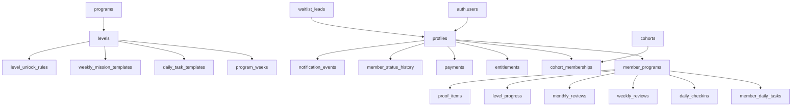

# 6-Month Challenge Supabase Schema Spec

## Purpose
This document translates the MVP domain model into a Supabase-first relational schema with clear ownership, access, auditability, and migration direction.

## Design Principles
- `auth.users` remains the identity source of truth.
- App data lives in `public` tables keyed back to `auth.users`.
- Progression, entitlements, and proof visibility must be auditable.
- Content becomes database-backed, not static-file-backed.
- RLS should default to least privilege, then expose only the small public surface required for founder proof and opt-in member proof.

## Current Model To Migrate
- `lib/phaseData.ts` becomes seeded content for the first five levels and their starter task templates.
- `lib/journeyData.ts` becomes the prototype for:
  - founder `profiles`
  - founder `daily_checkins`
  - founder `weekly_reviews`
  - founder `monthly_reviews`
  - founder `proof_items`

## Enum Set
- `app_role`
  - `member`
  - `founder_admin`
- `account_state`
  - `waitlisted`
  - `invited`
  - `active`
  - `paused`
  - `refunded`
  - `alumni`
  - `banned`
- `enrollment_state`
  - `waitlist`
  - `checkout_started`
  - `paid`
  - `onboarding`
  - `in_program`
  - `completed`
- `task_status`
  - `planned`
  - `completed`
  - `missed`
  - `skipped`
- `proof_type`
  - `metric`
  - `note`
  - `link`
  - `image`
- `proof_visibility`
  - `private`
  - `public_opt_in`
- `review_status`
  - `draft`
  - `submitted`
  - `missed`
  - `locked`
- `notification_type`
  - `welcome`
  - `onboarding_complete`
  - `daily_reminder`
  - `missed_day_followup`
  - `weekly_review_due`
  - `level_unlocked`
  - `founder_broadcast`
  - `payment_update`
- `notification_status`
  - `queued`
  - `sent`
  - `failed`
- `payment_status`
  - `pending`
  - `paid`
  - `refunded`
  - `failed`
- `lead_state`
  - `new`
  - `notified`
  - `converted`
  - `unsubscribed`
- `progress_decision_source`
  - `automatic`
  - `admin_override`
  - `admin_block`

## Entity Relationship Summary

## Table Specification

### `profiles`
One row per authenticated user.

Key columns:
- `id uuid primary key references auth.users(id)`
- `role app_role not null default 'member'`
- `display_name text not null`
- `handle text unique`
- `avatar_path text`
- `bio text`
- `timezone text not null default 'UTC'`
- `public_profile_enabled boolean not null default false`
- `created_at timestamptz not null default now()`
- `updated_at timestamptz not null default now()`

Notes:
- Founder is represented here with `role = 'founder_admin'`.

### `member_status_history`
Audit log of account-state changes.

Key columns:
- `id uuid primary key`
- `profile_id uuid not null references profiles(id)`
- `from_state account_state`
- `to_state account_state not null`
- `reason text`
- `changed_by uuid references profiles(id)`
- `changed_at timestamptz not null default now()`

### `waitlist_leads`
Pre-auth conversion capture that survives the waitlist-to-purchase transition.

Key columns:
- `id uuid primary key`
- `email citext not null unique`
- `full_name text`
- `lead_state lead_state not null default 'new'`
- `source text`
- `medium text`
- `campaign text`
- `referral_code text`
- `referred_by_lead_id uuid references waitlist_leads(id)`
- `converted_profile_id uuid references profiles(id)`
- `notes text`
- `created_at timestamptz not null default now()`
- `updated_at timestamptz not null default now()`

### `programs`
Top-level program entity. MVP starts with one row.

Key columns:
- `id uuid primary key`
- `slug text not null unique`
- `title text not null`
- `description text`
- `duration_days integer not null default 180`
- `status text not null default 'active'`
- `created_at timestamptz not null default now()`
- `updated_at timestamptz not null default now()`

### `levels`
Canonical six-level model.

Key columns:
- `id uuid primary key`
- `program_id uuid not null references programs(id)`
- `position integer not null`
- `slug text not null`
- `title text not null`
- `tagline text`
- `start_day integer not null`
- `end_day integer not null`
- `summary text`
- `is_final_level boolean not null default false`
- `created_at timestamptz not null default now()`
- `updated_at timestamptz not null default now()`

Constraints:
- unique `(program_id, position)`
- unique `(program_id, slug)`
- check `start_day <= end_day`

### `program_weeks`
Week definitions tied to levels and challenge ordering.

Key columns:
- `id uuid primary key`
- `program_id uuid not null references programs(id)`
- `level_id uuid not null references levels(id)`
- `week_number integer not null`
- `start_day integer not null`
- `end_day integer not null`
- `title text not null`
- `theme text`
- `created_at timestamptz not null default now()`

Constraints:
- unique `(program_id, week_number)`

### `daily_task_templates`
Reusable daily blueprint tasks, initially seeded from the current challenge structure.

Key columns:
- `id uuid primary key`
- `program_id uuid not null references programs(id)`
- `level_id uuid not null references levels(id)`
- `program_week_id uuid references program_weeks(id)`
- `day_offset integer`
- `title text not null`
- `description text`
- `sort_order integer not null default 0`
- `is_required boolean not null default true`
- `proof_required boolean not null default false`
- `proof_type_hint proof_type`
- `is_active boolean not null default true`
- `created_at timestamptz not null default now()`

Notes:
- `day_offset` can be null for templates that apply across the full week or level.

### `weekly_mission_templates`
The weekly mission instructions and success criteria.

Key columns:
- `id uuid primary key`
- `program_id uuid not null references programs(id)`
- `level_id uuid not null references levels(id)`
- `program_week_id uuid not null references program_weeks(id)`
- `title text not null`
- `instructions text not null`
- `success_criteria text not null`
- `created_at timestamptz not null default now()`

### `cohorts`
Enrollment windows or launch groups.

Key columns:
- `id uuid primary key`
- `program_id uuid not null references programs(id)`
- `name text not null`
- `slug text not null unique`
- `starts_on date not null`
- `ends_on date`
- `enrollment_opens_at timestamptz`
- `enrollment_closes_at timestamptz`
- `status text not null default 'planned'`
- `external_community_url text`
- `created_at timestamptz not null default now()`

### `cohort_memberships`
Historical cohort membership record for reporting and reassignments.

Key columns:
- `id uuid primary key`
- `cohort_id uuid not null references cohorts(id)`
- `profile_id uuid not null references profiles(id)`
- `member_program_id uuid references member_programs(id)`
- `joined_at timestamptz not null default now()`
- `left_at timestamptz`

Constraints:
- unique `(cohort_id, profile_id, joined_at)`

### `member_programs`
One active enrollment row per user for the core challenge.

Key columns:
- `id uuid primary key`
- `profile_id uuid not null references profiles(id)`
- `program_id uuid not null references programs(id)`
- `active_cohort_id uuid references cohorts(id)`
- `account_state account_state not null default 'waitlisted'`
- `enrollment_state enrollment_state not null default 'waitlist'`
- `start_date date`
- `activated_at timestamptz`
- `completed_at timestamptz`
- `current_day integer not null default 0`
- `current_level_id uuid references levels(id)`
- `primary_goal text`
- `secondary_goals jsonb not null default '[]'::jsonb`
- `rules_accepted_at timestamptz`
- `baseline_snapshot jsonb not null default '{}'::jsonb`
- `created_at timestamptz not null default now()`
- `updated_at timestamptz not null default now()`

Constraints:
- unique `(profile_id, program_id)`

### `member_notification_preferences`
Member reminder settings stored separately from auth identity.

Key columns:
- `id uuid primary key`
- `profile_id uuid not null unique references profiles(id)`
- `daily_reminder_enabled boolean not null default true`
- `daily_reminder_time time`
- `weekly_review_reminder_enabled boolean not null default true`
- `timezone text not null default 'UTC'`
- `created_at timestamptz not null default now()`
- `updated_at timestamptz not null default now()`

### `member_daily_tasks`
Materialized tasks assigned to each member and due date.

Key columns:
- `id uuid primary key`
- `member_program_id uuid not null references member_programs(id)`
- `daily_task_template_id uuid references daily_task_templates(id)`
- `level_id uuid not null references levels(id)`
- `program_week_id uuid references program_weeks(id)`
- `due_date date not null`
- `title text not null`
- `description text`
- `status task_status not null default 'planned'`
- `completed_at timestamptz`
- `skipped_at timestamptz`
- `missed_at timestamptz`
- `proof_required boolean not null default false`
- `same_day_editable_until timestamptz`
- `created_at timestamptz not null default now()`
- `updated_at timestamptz not null default now()`

Constraints:
- unique `(member_program_id, daily_task_template_id, due_date)`

### `daily_checkins`
End-of-day review and summary.

Key columns:
- `id uuid primary key`
- `member_program_id uuid not null references member_programs(id)`
- `checkin_date date not null`
- `status review_status not null default 'draft'`
- `summary text`
- `wins jsonb not null default '[]'::jsonb`
- `misses jsonb not null default '[]'::jsonb`
- `lessons jsonb not null default '[]'::jsonb`
- `submitted_at timestamptz`
- `locked_at timestamptz`
- `created_at timestamptz not null default now()`
- `updated_at timestamptz not null default now()`

Constraints:
- unique `(member_program_id, checkin_date)`

### `weekly_reviews`
Scorecard-style weekly review records.

Key columns:
- `id uuid primary key`
- `member_program_id uuid not null references member_programs(id)`
- `program_week_id uuid not null references program_weeks(id)`
- `weekly_mission_template_id uuid references weekly_mission_templates(id)`
- `status review_status not null default 'draft'`
- `summary text`
- `wins jsonb not null default '[]'::jsonb`
- `misses jsonb not null default '[]'::jsonb`
- `lessons jsonb not null default '[]'::jsonb`
- `next_week_adjustments jsonb not null default '[]'::jsonb`
- `score integer`
- `due_at timestamptz`
- `submitted_at timestamptz`
- `locked_at timestamptz`
- `created_at timestamptz not null default now()`
- `updated_at timestamptz not null default now()`

Constraints:
- unique `(member_program_id, program_week_id)`

### `monthly_reviews`
Monthly or level-end reflection records.

Key columns:
- `id uuid primary key`
- `member_program_id uuid not null references member_programs(id)`
- `level_id uuid not null references levels(id)`
- `status review_status not null default 'draft'`
- `summary text`
- `wins jsonb not null default '[]'::jsonb`
- `misses jsonb not null default '[]'::jsonb`
- `lessons jsonb not null default '[]'::jsonb`
- `reflection jsonb not null default '{}'::jsonb`
- `due_at timestamptz`
- `submitted_at timestamptz`
- `locked_at timestamptz`
- `created_at timestamptz not null default now()`
- `updated_at timestamptz not null default now()`

Constraints:
- unique `(member_program_id, level_id)`

### `proof_items`
Member proof records, including founder public proof.

Key columns:
- `id uuid primary key`
- `member_program_id uuid not null references member_programs(id)`
- `profile_id uuid not null references profiles(id)`
- `member_daily_task_id uuid references member_daily_tasks(id)`
- `daily_checkin_id uuid references daily_checkins(id)`
- `weekly_review_id uuid references weekly_reviews(id)`
- `monthly_review_id uuid references monthly_reviews(id)`
- `type proof_type not null`
- `visibility proof_visibility not null default 'private'`
- `label text not null`
- `text_value text`
- `numeric_value numeric`
- `url text`
- `storage_path text`
- `sort_order integer not null default 0`
- `created_at timestamptz not null default now()`

Constraints:
- check that at least one parent reference exists

### `level_unlock_rules`
Configurable thresholds evaluated by the progression engine.

Key columns:
- `id uuid primary key`
- `level_id uuid not null references levels(id)`
- `minimum_completed_days integer not null default 0`
- `minimum_weekly_reviews_submitted integer not null default 0`
- `monthly_review_required boolean not null default true`
- `maximum_missed_days integer`
- `minimum_proof_items integer not null default 0`
- `requires_founder_approval boolean not null default false`
- `grace_days integer not null default 0`
- `is_active boolean not null default true`
- `created_at timestamptz not null default now()`
- `updated_at timestamptz not null default now()`

Constraints:
- unique `(level_id)`

### `level_progress`
Audit table for unlock evaluations and overrides.

Key columns:
- `id uuid primary key`
- `member_program_id uuid not null references member_programs(id)`
- `level_id uuid not null references levels(id)`
- `decision_source progress_decision_source not null`
- `eligible boolean not null`
- `evaluation_started_on date not null`
- `evaluation_ended_on date not null`
- `metrics_snapshot jsonb not null default '{}'::jsonb`
- `decision_reason text`
- `decided_by uuid references profiles(id)`
- `unlocked_at timestamptz`
- `created_at timestamptz not null default now()`

### `announcements`
Member-visible internal broadcasts and notices.

Key columns:
- `id uuid primary key`
- `program_id uuid references programs(id)`
- `cohort_id uuid references cohorts(id)`
- `title text not null`
- `body text not null`
- `published_at timestamptz`
- `created_by uuid not null references profiles(id)`
- `created_at timestamptz not null default now()`

### `founder_updates`
Public or member-only founder content.

Key columns:
- `id uuid primary key`
- `profile_id uuid not null references profiles(id)`
- `title text not null`
- `summary text`
- `body text not null`
- `visibility proof_visibility not null default 'public_opt_in'`
- `x_post_url text`
- `published_at timestamptz`
- `created_at timestamptz not null default now()`

### `payments`
App-readable Stripe mirror for support and lifecycle reporting.

Key columns:
- `id uuid primary key`
- `profile_id uuid references profiles(id)`
- `member_program_id uuid references member_programs(id)`
- `stripe_customer_id text`
- `stripe_checkout_session_id text`
- `stripe_payment_intent_id text`
- `amount_cents integer not null`
- `currency text not null default 'usd'`
- `payment_status payment_status not null default 'pending'`
- `paid_at timestamptz`
- `refunded_at timestamptz`
- `created_at timestamptz not null default now()`

### `entitlements`
Normalized access rules derived from payments and admin actions.

Key columns:
- `id uuid primary key`
- `profile_id uuid not null references profiles(id)`
- `member_program_id uuid references member_programs(id)`
- `source text not null`
- `access_granted boolean not null default false`
- `starts_at timestamptz`
- `ends_at timestamptz`
- `revoked_at timestamptz`
- `reason text`
- `created_at timestamptz not null default now()`

### `notification_events`
Delivery and lifecycle log for Resend or automation messages.

Key columns:
- `id uuid primary key`
- `profile_id uuid references profiles(id)`
- `member_program_id uuid references member_programs(id)`
- `type notification_type not null`
- `status notification_status not null default 'queued'`
- `provider text not null default 'resend'`
- `provider_message_id text`
- `payload jsonb not null default '{}'::jsonb`
- `sent_at timestamptz`
- `failed_at timestamptz`
- `created_at timestamptz not null default now()`

### `referrals`
Referral model for later expansion, with light MVP readiness.

Key columns:
- `id uuid primary key`
- `referrer_profile_id uuid not null references profiles(id)`
- `referred_email citext`
- `referred_profile_id uuid references profiles(id)`
- `code text not null unique`
- `converted_at timestamptz`
- `created_at timestamptz not null default now()`

## Public Views

### `public_proof_items_v`
Expose only proof items where:
- `visibility = 'public_opt_in'`
- the related member has `public_profile_enabled = true`
- the parent record is in a submitted or published state

### `founder_journey_feed_v`
Public founder feed for `app/journey/page.tsx`, combining:
- founder updates
- founder proof items
- founder submitted check-ins and reviews

## RLS Matrix
- `profiles`
  - member: read/update own profile
  - founder_admin: read/update all profiles
- `member_programs`
  - member: read/update own enrollment-safe fields
  - founder_admin: read/update all
- `member_notification_preferences`
  - member: read/update own settings
  - founder_admin: read all
- `member_daily_tasks`, `daily_checkins`, `weekly_reviews`, `monthly_reviews`, `proof_items`
  - member: read/write own records only
  - founder_admin: read/write all
- `announcements`, `founder_updates`
  - member: read published records only
  - founder_admin: full access
- `waitlist_leads`, `payments`, `entitlements`, `notification_events`, `member_status_history`, `level_progress`
  - founder_admin or service role only
- public views
  - anonymous: read only

## Storage Buckets
- `proof-assets`
  - private bucket
  - signed URLs for member and founder/admin access
  - public proof is exposed through server-generated signed URLs or copied metadata, not direct open bucket access
- `avatars`
  - optionally public for simple profile rendering
- `founder-assets`
  - optional bucket for founder journey media

## Seed Strategy
- Seed one `program` row for `6-Month Challenge`.
- Seed six `levels` with day ranges:
  - Level 1: days `1-30`
  - Level 2: days `31-60`
  - Level 3: days `61-90`
  - Level 4: days `91-120`
  - Level 5: days `121-150`
  - Level 6: days `151-180`
- Seed `program_weeks` for weeks `1-26`, each mapped to the active level window.
- Transform the current `lib/phaseData.ts` content into:
  - level titles and summaries
  - starter `daily_task_templates`
- Seed a founder `profiles` row and a founder `member_programs` row.
- Transform the founder entries in `lib/journeyData.ts` into submitted founder check-ins, reviews, and proof.

## Migration Order
1. Create enums and foundational tables: `profiles`, `programs`, `levels`, `program_weeks`.
2. Add enrollment and lifecycle tables: `waitlist_leads`, `member_programs`, `cohorts`, `cohort_memberships`, `entitlements`, `payments`.
3. Add content and execution tables: `daily_task_templates`, `weekly_mission_templates`, `member_daily_tasks`, `daily_checkins`, `weekly_reviews`, `monthly_reviews`, `proof_items`.
4. Add progression and audit tables: `level_unlock_rules`, `level_progress`, `member_status_history`.
5. Add broadcast and automation tables: `announcements`, `founder_updates`, `notification_events`, `referrals`.
6. Create public views and RLS policies last, once query patterns are confirmed.

## Implementation Notes
- Use database triggers or application writes to keep `updated_at` current.
- Keep Stripe and Resend writes behind server-only paths.
- Avoid storing derived `current_day` only in the UI; persist it on `member_programs` and recalculate when needed.
- Do not make proof assets public by bucket policy. Public proof should be an application-level decision.
